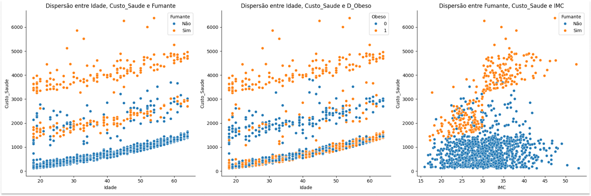

## 👁 Visão Geral

Este projeto visa analisar os dados de uma empresa do ramo alimentício a fim de investigar os possíveis fatores que mais se relacionam com o **custo do plano de saúde** e por fim indicar ações preventivas que a empresa pode fazer para diminuir esse custo

[📒 Notebook - Contexto](notebook/contexto.ipynb)

---
## 💼 Entendimento do negócio

Health Analytics nada mais é do que a aplicação de técnicas de análise de dados no campo da saúde para melhorar o atendimento médico, otimizar os processos de assistência à saúde, tomar decisões embasadas em dados e melhorar os resultados clínicos.
## 🔎 Análise SWOT

A análise SWOT é uma técnica que ajuda a identificar os pontos fortes, pontos fortes, oportunidades e ameaças de um projeto. Com ela iremos verificas os riscos do projeto, identificar áreas que precisam de atenção e desenvolver estratégias.

### Forças:

- **Benefícios de saúde**: A empresa pode otimizar os benefícios atuais para reduzir custos.
- **Dados disponíveis sobre a saúde dos colaboradores:** A empresa já tem informações sobre o uso do plano de saúde, dados sobre o imc e perfis de saúde.
- **Capacidade de negociação com fornecedores:** Empresas com contratos de seguro saúde têm potencial de renegociar coberturas e condições.
- **Engajamento dos colaboradores:** Programas de bem-estar e prevenção podem aumentar o engajamento e a motivação dos colaboradores.

### Fraquezas:

- **Cultura de bem-estar insuficiente:** Falta de uma cultura de saúde preventiva ou resistências internas podem prejudicar o sucesso das iniciativas.
- **Custos iniciais elevados:** Implementar novas iniciativas de saúde, como programas de bem-estar ou monitoramento da saúde, pode demandar investimentos iniciais.
- **Baixa adesão a programas de saúde:** Pode ser difícil envolver todos os colaboradores em programas de prevenção e bem-estar.
- **Complexidade do sistema de saúde:** Os sistemas de saúde em si podem ser complexos, tornando-se difícil controlar e prever os custos.

### Oportunidades:

- **Tecnologia e telemedicina:** A adoção de tecnologias, como telemedicina e wearables, pode reduzir os custos com consultas e exames presenciais.
- **Programas de prevenção e educação:** Investir em programas de educação sobre saúde, nutrição e exercícios pode prevenir doenças e reduzir o uso de plano de saúde.
- **Parcerias e programas de fitness:** Oferecer incentivos para atividade física pode melhorar a saúde geral dos colaboradores, reduzindo doenças crônicas.
- **Mudanças regulatórias:** Aproveitar novas legislações e políticas de incentivo fiscal que favoreçam empresas que investem em saúde corporativa.

### Ameaças:

- **Aumento dos custos com saúde:** Mesmo com medidas de controle, o aumento contínuo dos custos de planos de saúde pode diminuir o impacto das economias obtidas.
- **Mudanças demográficas:** Envelhecimento da força de trabalho pode aumentar a demanda por cuidados médicos.
- **Baixa aceitação das mudanças:** Respostas negativas dos colaboradores, especialmente se medidas de corte de benefícios forem vistas como prejudiciais.
- **Riscos legais:** Implementar políticas de saúde ou controle pode ser visto como invasão de privacidade ou discriminação, dependendo de como forem realizadas. 
---
## 📊 Analise Exploratória de Dados

[📒 Notebook - Projeto](notebook/projeto.ipynb)

Foram realizadas análises univariadas, bivariadas e multivariadas para entender os dados individualmente e como elas se relacionam com a nossa variável target `Custo_Saude`

Foram utilizadas técnicas de correlação de Pearson, para as variaveis quantitativas e determinação de coeficiente (R quadrado), para as variaveis qualitativas, para avaliar suas interações.

## 🎯 Planos de Ação

Após feita as análises, foi avaliado que os custos relacionados a saúde são fortemente influenciado aos funcionários **tabagistas** e que estão **acima do peso** influenciam no aumento do custo de saúde.

Para reduzir esses fatores podemos:
- Criar campanhas contra o tabagismo
- Montar grupos de apoios
- Oferecer sessões e programas de acompanhamento com especialistas em saúde para reduzir o hábito de fumar
- Oferecer apoio de nutricionistas para consultas regulares
- Incentivar atividades físicas
- Estimular a alimentação saudável no local de trabalho
